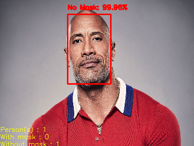
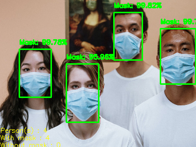
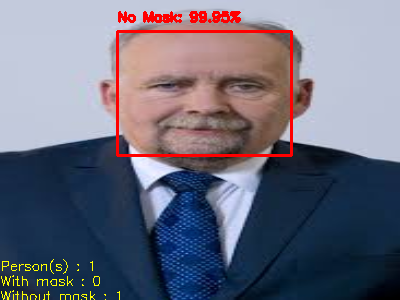

### 😷Mask Detection Project
---

### 📄Description
---
* In this project our purpose is building a model that detect mask on face(s).
* The model of this project is a pre-trained model that is fine tuned from `mobileNetV2` model.  

### 📐Models
---
`mask-detector.model`: A pre-trained model that is based on `mobileNetV2 ` model that detect whether the face is with mask or without mask.

`deploy.prototxt` & `res10_300x300_ssd_iter_140000.caffemodel`: Two essential CV2 DNN models to detect faces in images. 

**Note** : These models are available in this repository.

### 🎫 Dataset
---
* You can access the dataset via `mask_dataset` folder in this repository.
* The folder contains two subfolders, `with_mask` and `without_mask`.
* `without_mask` folder contains cropped faces.These faces does not have mask.
* `with_mask` folder contains persons that have a mask on their faces
* For avoiding any kind of biases we did not put the same person in these two folders.
* The dataset contains two classes, and each of them has `~1000` sample.So in this project we will not face `imbalanced dataset`.

### 💻🖥Installation
---
## 🛠Requirements
| Module/Framework        | Version           |
| ----------------------- |:-----------------:|
| tensorflow              | 2.4.1             |
| sklearn                 | 0.22.2.post1      |
| seaborn                 | 0.11.1            |
| pandas                  | 1.1.5             |
| numpy                   | 1.19.5            |
| cv2                     |  4.1.2            |
| PIL                     | 7.1.2             |
| matplotlib              | 3.2.2             |
| imutils                 | 0.5.4             |

### ⚙Setup
---

