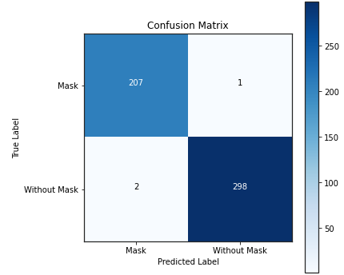

### 😷Mask Detection Project
---


### 📄Description
---
* In this project our purpose is building a model that detects mask on face(s).
* The model of this project is a pre-trained model that is fine tuned from `mobileNetV2` model.
* If you are interested in further details, you can access them in `mask-detection-training.ipynb` file in this repository

### 📐Models
---
`mask-detector.model`: A pre-trained model that is fine tuned from `mobileNetV2 ` model. This model detects whether the face is with mask or without mask.

`deploy.prototxt` & `res10_300x300_ssd_iter_140000.caffemodel`: Two essential CV2 DNN models to detect faces in images. So you have to download them to implement this project.

**Note** : These models are available in this repository.

### 📈📉📊Model Performance
---
* This model has reached `99%` accuracy in `validation set` and `training set` in 20 epochs which is acceptable.
* This model classified all the samples correctly, except `~5` of them.
* You can see the `classification report` and `confusion matrix` for further details down below.





### 🎫 Dataset
---
* You can access the dataset via `mask_dataset` folder in this repository.
* The folder contains two subfolders, `with_mask` and `without_mask`.
* `without_mask` folder contains cropped faces. These faces do not have mask.
* `with_mask` folder contains persons that has a mask on their faces.
* For avoiding any kind of biases we did not put the same face in these two subfolders.
* The dataset contains two classes, and each of them has `~1000` samples. So in this project we will not face an `imbalanced dataset`.

### 💻🖥Installation
---
## 🛠Requirements
| Module/Framework        | Version           |
| ----------------------- |:-----------------:|
| tensorflow              | 2.4.1             |
| sci-kit learn           | 0.22.2.post1      |
| seaborn                 | 0.11.1            |
| pandas                  | 1.1.5             |
| numpy                   | 1.19.5            |
| cv2                     | 4.1.2             |
| PIL                     | 7.1.2             |
| matplotlib              | 3.2.2             |
| imutils                 | 0.5.4             |

### ⚙Setup
---
Tensorflow:
```
$ pip install tensorflow==2.4.1
```
Scikit-learn:
```
$ pip install scikit-learn==0.22.2.post1
```
Seaborn:
```
$ pip install seaborn==0.11.1
```
Pandas:
```
$ pip install pandas==1.1.5 
```
Numpy:
```
$ pip install numpy==1.19.5
```
CV2:
```
$ pip install cv2==4.1.2 
```
PIL:
```
$ pip install PIL==7.1.2
```
Matplotlib:
```
$ pip install matplotlib==3.2.2 
```
Imutils:
```
$ pip install imutils==0.5.4
```
### 👥Contributers
---
Kasra1377
